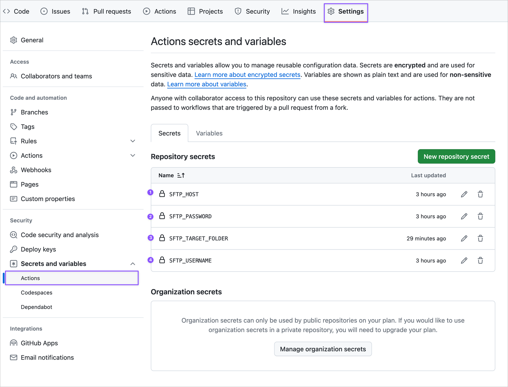

# Automatic Deployment via GitHub CI/CD Pipeline

This setup utilizes `pnpm` for package management.

```bash
# Install dependencies
pnpm install

# Prepare for husky setup
pnpm prepare
```

## Setup Instructions

1. 🚀 **Creating a New Repository for the Project:**
  - At the top of the page, click "Use this template" then "Create a new repository".
  - Check "Include all branches".
  - Add **secret** keys to the repository as shown in the diagram below:
    

2. ⚙️ **Environment Setup `.env`:**
  - Add the Webflow site URL (development version) to `VITE_DEV_WEBSITE_URL`:
   ```dotenv
   VITE_DEV_WEBSITE_URL="https://<website>.webflow.io"
   ```
  - Set the project name in `VITE_PROJECT_NAME`. This is important for the GitHub CI/CD process, as the system reads the project name and creates a directory on the server at `home/my-server/projects/my-project`.
   ```dotenv
   VITE_PROJECT_NAME="name-of-project"
   ```

3. 🤘 **Widget Creation:**
  - Create widgets in the `./src/widgets` directory.
  - The folder name should match the name specified in the `data-widget="name"` attribute, e.g., for `data-widget="slider-review"` the folder should be `./src/widgets/slider-review`.
  - This folder should contain `index.ts`, `index.css`, and any necessary subdirectories.

4. 💅 **Global CSS Variables:**
  - If needed, add global rules such as colors, font sizes, and margins inside `./src/index.css`.

5. 🐌 **Main Script:**
  - Do not alter the script in `./src/index.ts`. On the Webflow site, this script checks for elements (widgets) on the page with the `data-widget="<widget-name>"` attribute and dynamically loads scripts for all detected widgets.

6. 😵‍💫 **Webflow:**
  - On the project's Webflow site, add the following script to "Custom Code":
   ```html
   <script>
     document.addEventListener('DOMContentLoaded', function() {
       const initCustomScript = () => {
         const isLocalMode = window.location.protocol === 'http:';
         const isProdMode = !window.location.hostname.endsWith('webflow.io') && !isLocalMode;

         const SCRIPT_BASE_URL = isLocalMode ? window.location.origin : 'https://my-server.com/projects/my-project';

         const script = document.createElement('script');
         const mode = isProdMode ? 'prod' : isLocalMode ? 'src' : 'dev';

         const fileName = isLocalMode ? 'index.ts' : 'index.js';

         script.src = [SCRIPT_BASE_URL, mode, fileName].join('/');
         script.type = 'module';

         document.body.appendChild(script);
       }

       initCustomScript();
     });
   </script>
   ```

> This code snippet will add the main script from either `dev` or `prod` mode, which in turn loads all widgets onto the page.
```html
<!-- Dev -->
<script src="https://my-server.com/projects/<folder-name-of-project-on-server>/dev/index.js"></script>
```
or
```html
<!-- Prod -->
<script src="https://my-server.com/projects/<folder-name-of-project-on-server>/prod/index.js"></script>
```

## How It Works:

- **Develop (`develop`):** This branch is the main development branch where most work occurs.
  - When you push changes to `git push origin develop`, it triggers `./.github/workflows/sftp-deploy-dev.yml`.
  - This script places files in `home/my-server/projects/<folder-name-of-project-on-server>/dev`.
  - If the domain address contains `webflow.io`, it indicates development mode, and the main script (`./src/index.ts`) extracts scripts from this directory.

- **Master (`master`):** To simplify development, this branch is not created. It must be created just before publishing the site in production.
  - When changes are pushed to the `master` branch, it activates `./.github/workflows/sftp-deploy-prod.yml`, which uploads files to `home/my-server/projects/<folder-name-of-project-on-server>/prod`.
  - If the site's address does not include `webflow.io`, scripts are loaded from the `prod` directory.

> This setup ensures that scripts for development (webflow.io) and production (published site) are isolated and managed separately.

---

The project folder on the server is automatically created (the folder name is taken from `package.json` from the `name: "my-project"` field), so there's no need to create it manually!

Here's the correct structure for widget folders in development mode. The build script goes through all folders inside `widgets`, creates entry points like `widgets/slider-review/index.ts`, and outputs a script named after the folder `dist/slider-review.ts` that will be linked to the page if there is an element on the page with the `data-widget="slider-review"` attribute.

```
src/
└── 1) app/
└── 2) widgets/
└──── slider-review/
├────── index.css          
├────── index.ts           
└──── feedback-modal/
├────── index.css          
├────── index.ts   
└── 3) features/
└── 4) shared/        
```

## Directories and Imports
```
"@root/*": ["src/*"],
"@app/*": ["src/app"],
"@widgets/*": ["src/widgets/*"],
"@features/*": ["src/features/*"],
"@shared/*": ["src/shared/*"]
```

1) `@root` - the root directory of the project, containing the main script `index.ts` (do not change anything inside) and `index.css` (modifiable as needed).
2) `@app` - initializing file.
3) `@widgets` - the folder for widgets.
4) `@features` - currently used as the entry point for global things like custom scroll.
5) `@entities` - (rarely needed and debatable) where some common states are kept, for example, two widgets looking at changes in the same state object. This might be a form object with data (calculator), and two different widgets look at the data object and display something (chart, information block).
6) `@shared` - this folder contains common configurations, components, helpers. For instance, instead of writing Axios requests everywhere, you can create one instance inside `@shared/api` and export it wherever needed, like `import { api } from '@shared/api';`.

> ☝️ It's important to maintain the import order:
- Level 5 cannot import anything from levels above it.
- Level 4 can import everything in level 5 but cannot import anything above it.
- Level 3 can import levels 4 and 5, and so on. This prevents cross-import issues in the code.
- Also, you cannot import from level 3 to 3, i.e., one widget cannot import another widget.
- Importing one into another is only possible within `shared`, if components have been created there, like `shared/ui/form` importing `shared/ui/input`.